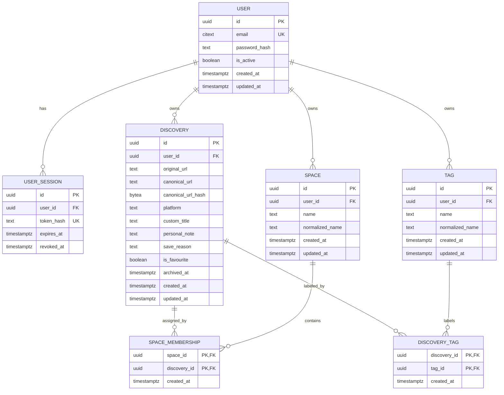

# Entity Relationships

The diagrams show relational shape, not a promise to create every future table now. All private paths ultimately belong to one User.

## Evolutionary model

```mermaid
erDiagram
    USER ||--o{ USER_SESSION : authenticates
    USER ||--o{ DISCOVERY : owns
    USER ||--o{ SPACE : owns
    USER ||--o{ TAG : owns
    USER ||--o{ MEMORY_THREAD : owns
    USER ||--o{ DISCOVERY_CONNECTION : owns
    USER ||--o{ REDISCOVERY_EVENT : receives
    USER ||--o{ REDISCOVERY_FEEDBACK : authors
    USER ||--o{ INSIGHT : owns
    USER ||--o{ AUDIT_EVENT : may_act_in

    DISCOVERY ||--o{ SPACE_MEMBERSHIP : assigned_by
    SPACE ||--o{ SPACE_MEMBERSHIP : contains
    DISCOVERY ||--o{ DISCOVERY_TAG : labeled_by
    TAG ||--o{ DISCOVERY_TAG : labels

    DISCOVERY ||--o| METADATA_RECORD : has_current
    DISCOVERY ||--o{ ENRICHMENT_JOB : processed_by
    DISCOVERY ||--o{ DISCOVERY_VISIT : revisited_by
    DISCOVERY ||--o{ DISCOVERY_INTENT : has
    DISCOVERY ||--o{ DISCOVERY_CONNECTION : source_of
    DISCOVERY ||--o{ DISCOVERY_CONNECTION : target_of

    MEMORY_THREAD ||--o{ MEMORY_THREAD_MEMBERSHIP : groups
    DISCOVERY ||--o{ MEMORY_THREAD_MEMBERSHIP : participates_in
    DISCOVERY ||--o{ REDISCOVERY_EVENT : presented_in
    MEMORY_THREAD o|--o{ REDISCOVERY_EVENT : may_prompt
    REDISCOVERY_EVENT ||--o| REDISCOVERY_FEEDBACK : receives

    DISCOVERY o|--o{ INSIGHT : may_ground
    MEMORY_THREAD o|--o{ INSIGHT : may_ground

    USER {
        uuid id PK
        citext email UK
        text password_hash
        boolean is_active
        timestamptz created_at
    }
    USER_SESSION {
        uuid id PK
        uuid user_id FK
        text token_hash UK
        timestamptz expires_at
        timestamptz revoked_at
    }
    DISCOVERY {
        uuid id PK
        uuid user_id FK
        text original_url
        text canonical_url
        bytea canonical_url_hash
        text platform
        text custom_title
        text personal_note
        text save_reason
        boolean is_favourite
        timestamptz archived_at
        timestamptz created_at
    }
    SPACE {
        uuid id PK
        uuid user_id FK
        text name
        text normalized_name
    }
    SPACE_MEMBERSHIP {
        uuid space_id PK, FK
        uuid discovery_id PK, FK
        timestamptz created_at
    }
    TAG {
        uuid id PK
        uuid user_id FK
        text name
        text normalized_name
    }
    DISCOVERY_TAG {
        uuid discovery_id PK, FK
        uuid tag_id PK, FK
        timestamptz created_at
    }
    DISCOVERY_INTENT {
        uuid id PK
        uuid discovery_id FK
        text kind
        text status
    }
    METADATA_RECORD {
        uuid id PK
        uuid discovery_id FK, UK
        text source_title
        text description
        text provider
        timestamptz fetched_at
    }
    ENRICHMENT_JOB {
        uuid id PK
        uuid discovery_id FK
        text job_type
        text status
        timestamptz available_at
    }
    DISCOVERY_VISIT {
        uuid id PK
        uuid discovery_id FK
        timestamptz visited_at
        text surface
    }
    DISCOVERY_CONNECTION {
        uuid id PK
        uuid user_id FK
        uuid source_discovery_id FK
        uuid target_discovery_id FK
        text provenance
    }
    REDISCOVERY_EVENT {
        uuid id PK
        uuid user_id FK
        uuid discovery_id FK
        uuid memory_thread_id FK
        timestamptz presented_at
    }
    REDISCOVERY_FEEDBACK {
        uuid id PK
        uuid rediscovery_event_id FK, UK
        uuid user_id FK
        text action
    }
    MEMORY_THREAD {
        uuid id PK
        uuid user_id FK
        text title
        text provenance
    }
    MEMORY_THREAD_MEMBERSHIP {
        uuid memory_thread_id PK, FK
        uuid discovery_id PK, FK
        integer position
    }
    INSIGHT {
        uuid id PK
        uuid user_id FK
        uuid discovery_id FK
        uuid memory_thread_id FK
        text content
        text provenance
    }
    AUDIT_EVENT {
        uuid id PK
        uuid actor_user_id FK
        text event_type
        timestamptz occurred_at
        text outcome
    }
```

The two `DISCOVERY_CONNECTION` relationships use different foreign keys on the same table. Mermaid shows the cardinality but cannot express endpoint checks or same-owner constraints. Likewise, an Insight has a nullable grounding relation because its exact subject is feature-dependent; a future migration must add an appropriate check constraint.

## MVP-only model

## Relationships and cardinalities

- A User has zero or many User Sessions, Discoveries, Spaces, Tags, and future Memory Threads. Each of those rows has exactly one owning User.
- A Discovery belongs to exactly one User. A User can independently preserve a URL another User has preserved; duplicate identity never crosses the owner boundary.
- Discoveries and Spaces are many-to-many through Space Membership. A Discovery can be in no Spaces, and an empty Space is valid.
- Discoveries and Tags are many-to-many through Discovery Tag. A Tag can exist before it is assigned.
- A Discovery has zero or one current Metadata Record. It can have many Enrichment Jobs, Visits, Intents, Rediscovery Events, and connections.
- A Discovery Connection has exactly one source and target Discovery. Both must belong to the connection's User and must differ.
- Discoveries and Memory Threads are many-to-many. An inferred membership can include a score and explanation; neither parent owns the other.
- A Rediscovery Event presents exactly one Discovery and may be associated with one Memory Thread. It receives at most one current feedback record under the proposed design.
- An Insight belongs to one User and is grounded in a defined subject such as a Discovery or Memory Thread. Its content cannot be treated as a source fact.

## Ownership boundaries

`users.id` is the tenant boundary. Top-level private tables carry `user_id` so normal queries can lead with ownership. Dependent tables inherit ownership through their parent, but creating a join requires loading both parents with the current user's scope. Future high-risk or bulk paths may denormalize `user_id` into joins and use composite foreign keys to enforce same-tenant membership; that complexity is not required for the initial schema.

Authentication establishes the current User. Authorization separately scopes access to each owned resource. Possession of a UUID is never evidence of access.

## Deletion and cascades

| Parent action | Dependent behavior |
| --- | --- |
| Delete User after any account grace period | Revoke/delete Sessions; cascade all owned product and derived data; anonymize or separately expire allowed Audit Events |
| Archive Discovery | Set `archived_at`; preserve all relationships and include it in duplicate detection |
| Permanently delete Discovery | Cascade memberships, tags joins, metadata, jobs, visits, connections, thread memberships, rediscovery records, and grounded derived data |
| Delete Space | Cascade Space Memberships only; preserve Discoveries |
| Delete Tag | Cascade Discovery Tags only; preserve Discoveries |
| Delete Memory Thread | Cascade memberships and thread-only derived records; preserve Discoveries |

Foreign keys should use `ON DELETE CASCADE` only for genuine owned dependents. Audit actor references use `ON DELETE SET NULL`. Product deletion and backup expiry are distinct: removed live data remains only in encrypted backups until the published backup-retention window closes.

## Growing from MVP without destructive migrations

The MVP keeps stable identities, ownership, URLs, personal context, and organization in normalized tables. Growth is additive:

1. Add `metadata_records` without moving or renaming user-authored fields. Backfill nothing; missing metadata is a valid state.
2. Add `enrichment_jobs` when asynchronous work exists. Discovery creation remains independent of job success.
3. Add visits and structured intents while retaining `save_reason`; migrate to structured intent only after product validation, and keep the original text.
4. Add connections and Memory Threads as edge/membership tables referencing existing Discovery UUIDs.
5. Add rediscovery, Insight, entity/topic, and embedding tables with explicit provenance and versioning. No vector column needs to be added to Discovery.
6. If canonicalization improves, write a new normalization version and run a collision-reporting backfill before changing uniqueness. Never overwrite `original_url`.

This path avoids splitting a monolithic Discovery later because fetched and inferred data are separate from the beginning conceptually, while avoiding empty future tables operationally.
